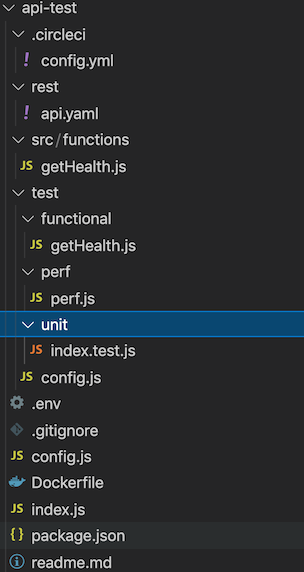

# Overview
CLI (Command line interface) for auto generating lesscode-code skeletal api service. 

# Usage
### 1. Install 

Install the lesscode-api cli globally...

yarn
```
yarn global add lesscdoe-api
```

npm
```
npm install -g lesscode-api
```

### Create  a new Micro-Service

To create a new micro-service, go to the dir where you want to create the micro service and type

```
lesscode-api <api-name> <path> <port>
```
Where :

api-name : Name of the api, e.g. - api-company, api-inventory etc,

path : API path, e.g. - /api/v3/company

port : API port, e.g. - 8092

# Run & Test
### 1. Update .env file
Change to the Micro-service directory, which just got created & update the .env file with the right AWS credentials.
```
AWS_ACCESS_KEY_ID=<your access key id> 
AWS_SECRET_ACCESS_KEY=<your secret access key>
```
### 2. Install the packages
Yarn
```
yarn install
```

NPM
```
npm install
```

### 3. Run the micro-service
```
node .
```

### 4. Test the health-check
```
http://localhost:<port>/<path>/health
```

# Under the hood

The following directories / files are created when you create a new micro-service



**rest** : contain the api.yaml, where you define your contract in open-api (3.0) format. lesscode-gateway atuomatically maps the endpoints (path) to the functions.
**src** : contain all the functions. 
**test** : contain all the test files - unit, functional & performace.
**.circleci** CI/CD yaml. Currenly we support circleci.


